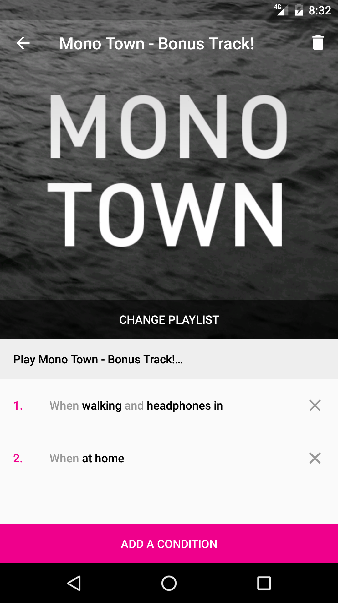

# LostContext-App
Android App using the Awareness API 

# Kotlin

100 % of the app has also been rewritten in Kotlin. The java implementation is kept on a  on a [deprecated branch](https://github.com/LostInContext/LostContext-App/tree/java).

It is also a good example of how to make Dagger 2 and DataBinding work with Kotlin.

 License
 -------
 `LostContext` is available under the [Beerware](http://en.wikipedia.org/wiki/Beerware) license.
